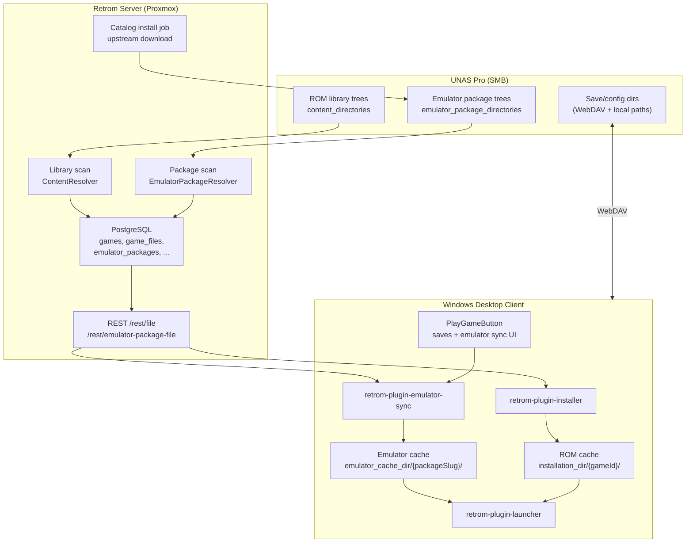
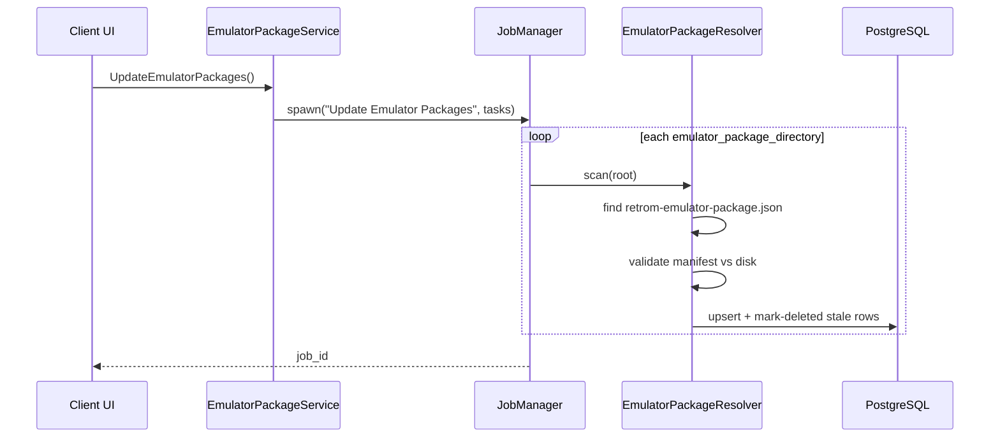
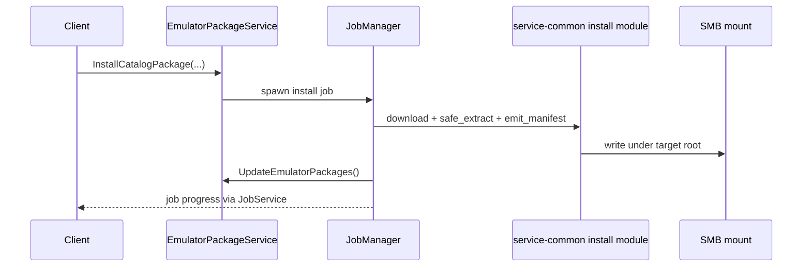
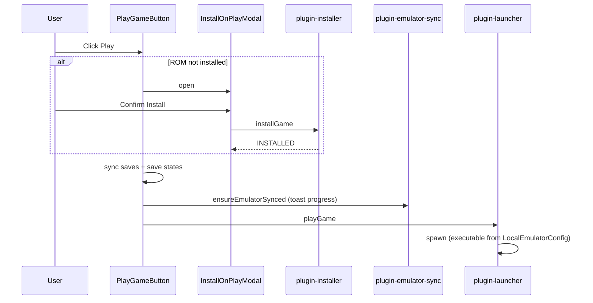
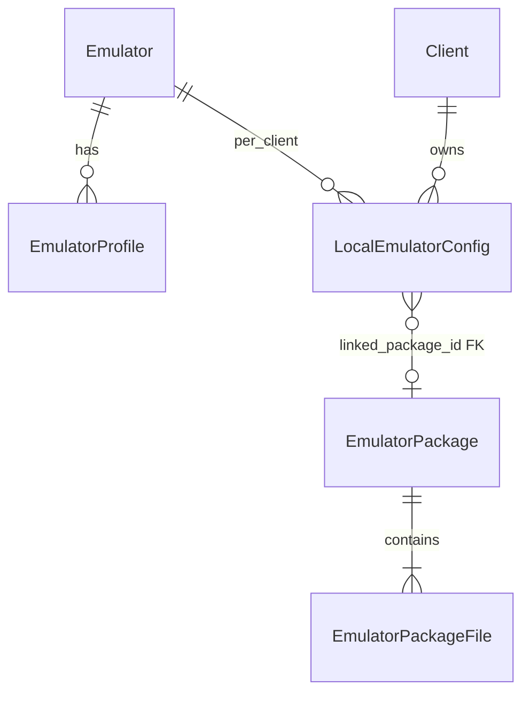
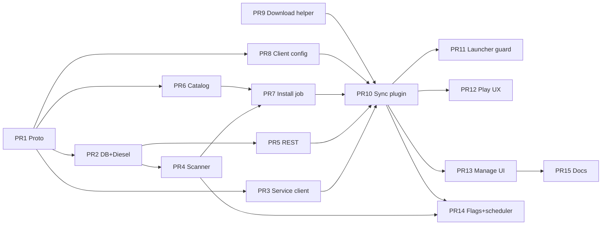

# Retrom Emulation Cloud: Emulator Package Sync Design

| Field | Value |
|-------|-------|
| **Author** | JoeyD551 (design draft) |
| **Date** | 2026-06-10 |
| **Revision** | 3 (re-review e0696f1c) |
| **Status** | Draft |
| **Repository** | `E:\retrom` (fork: JoeyD551/retrom) |
| **Design doc path** | `design/emulation-cloud.md` (`docs/` is the upstream wiki submodule) |
| **Setup guide** | `design/emulation-cloud-setup.md` |
| **Target deployment** | Proxmox server + UNAS Pro SMB share + Windows desktop client |
| **Git policy** | Fork-only: push to `origin` (JoeyD551/retrom) only; `upstream` read-only; no upstream PRs |
| **Switch ROM folder** | `switch` (lowercase basename under `content_directories`) |
| **Switch emulators (catalog)** | Eden, Citron, Ryubing (active maintained forks) |

---

## Overview

This design extends Retrom from a ROM library manager with manually configured emulator paths into a personal **emulation cloud**: ROMs, saves, configs, and emulator **packages** live on a NAS (UNAS Pro over SMB); the Windows desktop client keeps a local runtime cache and launches games seamlessly.

The core addition is an **Emulator Package** abstraction: a versioned, manifest-described directory tree on the NAS that the server indexes (mirroring today's ROM `content_directories` → `game_files` pipeline) and the client syncs in full before launch (never executing from UNC). A built-in **catalog** ships metadata and upstream download URLs only—users initiate installs to their NAS. Play flow gains a **ROM install prompt** when the user clicks Play on a non-installed game; emulator sync runs in the UI layer (mirroring save sync) with progress toasts before launch.

---

## Background & Motivation

### Current architecture (verified in codebase)

Retrom today separates **global emulator definitions** from **per-client local paths**:

| Layer | Proto / storage | Role |
|-------|-----------------|------|
| `Emulator` | `packages/codegen/protos/retrom/models/emulators.proto` | Name, platforms, save strategy, OS list; no binary path |
| `EmulatorProfile` | same | Launch args with `{file}`, `{install_dir}` placeholders |
| `DefaultEmulatorProfile` | same | Per `client_id` + `platform_id` default |
| `LocalEmulatorConfig` | same → PostgreSQL `local_emulator_configs` | Per `client_id` + `emulator_id`: `executable_path`, save paths |

**ROM install pipeline** (`plugins/retrom-plugin-installer`):

- Client calls `install_game` → fetches game files via gRPC → downloads each file from `{host}/rest/file/{fileId}` (`packages/rest-service/src/file.rs`) into `{installation_dir}/{gameId}/`.
- Installation state tracked in-plugin (`InstallationIndex` map); UI uses separate Install vs Play buttons (`packages/client-web/src/components/action-button/index.tsx`).

**Play pipeline** (`plugins/retrom-plugin-launcher/src/commands.rs`):

```rust
// Lines 148-152: hard fail if ROM not installed
if !standalone
    && installer.get_game_installation_status(game_id).await != InstallationStatus::Installed
{
    return Err(crate::Error::NotInstalled(game_id));
}
// Lines 222-234: fetch executable_path from server via gRPC
let res = emulator_client.get_local_emulator_configs(...).await?;
let local_config = res.configs.first().expect("No emulator config found");
let mut cmd = launcher.get_open_cmd(&local_config.executable_path);
```

**Server library scan** (`packages/grpc-service/src/library/update_handlers.rs`):

- Reads `ServerConfig.content_directories` (`packages/codegen/protos/retrom/server/config.proto`).
- `ContentResolver` walks SMB/local paths, resolves games/platforms/files into PostgreSQL.

**Emulator management UI** (`packages/client-web/src/components/modals/manage-emulators/`):

- Users create `Emulator` records and manually set `executable_path` via file picker (`local-configs.tsx`).
- Built-in emulators are EmulatorJS/libretro WASM cores (DB seed in `packages/db/migrations/2025-03-06-201526_built-in-emulators/up.sql`)—not standalone desktop binaries.

### Pain points for emulation-cloud use case

1. **No emulator package concept** — binaries must be hand-pathed per client; NAS copies are not first-class.
2. **No emulator sync** — client cannot pull emulator trees from server/NAS before launch.
3. **Play UX gap** — `ActionButton` swaps Install for Play when ROM not installed; no install-on-Play prompt; `play_game` returns `NotInstalled` error with `onError: console.error` only (`usePlayGame.ts`).
4. **No server emulator roots** — `ServerConfig` has `content_directories` only (fields 1–7 in `config.proto`); no parallel for emulator packages.
5. **No upstream install path** — unlike EmulatorJS auto-download (`packages/service-common/src/emulator_js/mod.rs`), desktop emulators have no catalog/install flow.
6. **UNC execution risk** — running emulators directly off `\\unas\...` causes locking, AV, and path issues on Windows; requirement is local cache copy.

### Deployment context

- **Server**: Retrom gRPC + REST on Proxmox VM; SMB mount to UNAS (e.g. `/mnt/retrom/...`).
- **NAS**: Source of truth for ROMs (`content_directories`) and emulator packages (`emulator_package_directories`).
- **Client**: Windows desktop (Tauri); `installation_dir` in `RetromClientConfig.Config` (`client-config.proto`) for ROM cache.

---

## Goals & Non-Goals

### Goals

1. **User-configurable emulator roots** on the server, analogous to `content_directories`, with user-defined folder layout underneath (optional custom layout macros).
2. **Emulator Package** manifest format with versioning, file inventory, and executable resolution.
3. **Server indexing + REST download** mirroring the ROM `GameFile` / `/rest/file/{id}` pattern.
4. **Built-in catalog** of common emulator package definitions (RPCS3, PCSX2, Eden, Citron, Ryubing, etc.) with upstream URLs; users add custom catalog entries.
5. **User-initiated "Install to NAS"** from catalog (server-side download/extract into configured share path).
6. **Client local emulator cache** — full package folder copy before launch; link to `LocalEmulatorConfig`.
7. **Play flow**: on Play when ROM `NOT_INSTALLED`, show confirmation modal before download; **add** explicit Install affordance in game detail menu (today's only Install entry is removed when primary becomes always-Play).
8. **Sync-before-launch** for emulators with progress UI in `PlayGameButton` (same pattern as save sync).
9. **UNAS auto-update**: server re-scan + version/hash comparison; client pulls updates without breaking user config dirs.

### Non-Goals

- Redistributing emulator binaries in the Retrom repo or release artifacts (metadata/catalog only).
- Running emulators from UNC/SMB paths (explicitly rejected).
- Replacing WebDAV save sync (`retrom-plugin-save-manager`) — save paths remain user-configurable; manifest may suggest defaults only.
- Linux/macOS desktop client support in v1 (design supports via `OperatingSystem` enum, implementation prioritizes Windows).
- Switch 2 / future platforms until upstream artifacts exist in catalog.
- Automatic silent ROM install on Play (user must confirm).

### Development workflow (fork-only)

- **Remotes**: `origin` → JoeyD551/retrom (push); `upstream` → jmberesford/retrom (fetch/pull only).
- **Branches**: Short-lived branches per implementation chunk (e.g. `feat-emulation-cloud-pr-01-protos` — no `/` suffix; `feat/emulation-cloud` branch name blocks nested refs), merged into `feat/emulation-cloud` on the fork.
- **Commits**: [Conventional Commits](https://www.conventionalcommits.org/) per `CONTRIBUTING.md`; message body explains what and why.
- **Pre-commit**: `pnpm nx sync` and format/lint/typecheck from `CONTRIBUTING.md`.
- **No upstream PRs** until explicitly decided later; no pushes to `upstream` or `JMBeresford/retrom` via API/CLI.
- **Never push `main`** without explicit approval.

---

## Proposed Design

### High-level architecture



### 1. Emulator Package abstraction

#### 1.1 On-disk layout (NAS / cache)

Each installed package is a directory tree with a mandatory manifest at its root:

```
{user-defined-path}/                    # under emulator_package_directory root
  rpcs3/                                # package slug (user or catalog-defined)
    0.0.34-17089/                       # version directory (upstream tag)
      retrom-emulator-package.json      # manifest (required)
      rpcs3.exe
      config/
      ...                               # upstream files
```

**User layout flexibility**: `EmulatorPackageDirectory` supports an optional **dedicated** layout definition (not a reuse of ROM `ContentResolver` macros — see §1.1.1).

Default layout (when `custom_package_layout` is unset):

```
{root}/{packageSlug}/{version}/**
```

Custom example:

```
{root}/emulators/{os}/{packageSlug}/{version}/**
```

#### 1.1.1 Dedicated package layout parser

ROM `ContentResolver` (`packages/grpc-service/src/library/content_resolver/parser.rs`) only understands `{library}`, `{platform}`, `{gameDir}`, `{gameFile}`, and user-defined `{name}` tokens. Emulator layouts require different tokens — **do not extend the ROM parser**.

New proto message in `server/config.proto`:

```protobuf
message EmulatorPackageLayoutDefinition {
  // e.g. "{root}/{packageSlug}/{version}/{file}"
  string definition = 1;
}
```

New module: `packages/grpc-service/src/emulator_packages/layout_parser.rs`

| Token | Meaning |
|-------|---------|
| `{root}` | `EmulatorPackageDirectory.path` |
| `{packageSlug}` | Directory segment or manifest `package_slug` |
| `{version}` | Version directory segment |
| `{os}` | `windows` / `linux` / `macos` from manifest |
| `{file}` | Relative file path within package (scan inventory only) |

`EmulatorPackageDirectory` proto (aligned naming with `custom_library_definition` convention):

```protobuf
message EmulatorPackageDirectory {
  string path = 1;
  optional IgnorePatterns ignore_patterns = 2;
  optional EmulatorPackageLayoutDefinition custom_package_layout = 3;
}
```

#### 1.2 Manifest format (`retrom-emulator-package.json`)

```json
{
  "schema_version": 1,
  "package_slug": "rpcs3",
  "display_name": "RPCS3",
  "version": "0.0.34-17089",
  "retrom": {
    "catalog_id": "rpcs3-windows-x64",
    "emulator_name": "RPCS3"
  },
  "platform": {
    "os": "windows",
    "arch": "x86_64"
  },
  "executable": {
    "relative_path": "rpcs3.exe",
    "working_dir_relative": "."
  },
  "save_hints": {
    "save_data_relative_paths": ["dev_hdd0/home/00000001/savedata"],
    "save_states_relative_paths": []
  },
  "preserve_paths": [
    "config/",
    "dev_hdd0/",
    "games/"
  ],
  "files": [
    {
      "relative_path": "rpcs3.exe",
      "size": 15234567,
      "sha256": "ab12...",
      "optional": false
    }
  ]
}
```

| Field | Purpose |
|-------|---------|
| `package_slug` + `version` | Stable identity for indexing and cache paths |
| `executable.relative_path` | Resolved under cache root → written to `LocalEmulatorConfig.executable_path` when `managed_paths=true` |
| `preserve_paths` | Prefixes excluded from overwrite on NAS upgrade and client cache refresh |
| `files[]` | Authoritative inventory for sync and delta detection |
| `retrom.catalog_id` | Links catalog entry → installed instance (optional for fully custom packages) |

**Versioning strategy**: Package version is the directory name and manifest field. Server stores `(package_slug, version)` as unique key. Catalog installs always write a new version directory, never in-place overwrite of `preserve_paths` content.

**Version ordering ("latest")** — no `semver` crate (not in workspace `Cargo.toml`). Use `compare_package_versions(a, b)` in `packages/service-common/src/emulator_packages/version.rs`:

```rust
/// Returns Ordering for "which version is newer"
pub fn compare_package_versions(a: &str, b: &str) -> Ordering {
    // 1. If both parse as semver (regex: ^\d+\.\d+), use numeric component comparison
    // 2. Else if both match GitHub tag pattern (e.g. "0.0.34-17089"), compare leading semver
    //    then numeric build suffix after '-'
    // 3. Else lexicographic descending on version string
    // 4. Tie-break: emulator_packages.created_at (newer wins)
}
```

| Example slug | Versions | "Latest" pick |
|--------------|----------|---------------|
| `rpcs3` | `0.0.34-17089`, `0.0.33-17000` | `0.0.34-17089` (semver prefix, then build suffix) |
| `pcsx2` | `v2.0.2`, `v2.0.1` | Strip `v` prefix, semver compare |
| `custom-emu` | `nightly-2026-06-01`, `nightly-2026-05-01` | Lexicographic, then `created_at` |

`GetEmulatorPackages` returns per-slug `latest_package_id` (computed at scan time) **in addition to** all version rows. Client sync uses **pinned** `linked_package_id` when set; UI "Update to latest" sets `linked_package_id` to `latest_package_id`.

#### 1.3 Catalog definition (metadata only, shipped in repo)

Bundled at `packages/service-common/src/emulator_catalog/` (JSON files, one per entry):

```json
{
  "catalog_id": "rpcs3-windows-x64",
  "display_name": "RPCS3",
  "description": "PlayStation 3 emulator",
  "supported_platform_folder_names": ["ps3"],
  "operating_systems": ["WINDOWS"],
  "installable": true,
  "deprecated": false,
  "legal_notice": null,
  "default_profile": {
    "name": "Default",
    "supported_extensions": ["iso", "bin", "pkg"],
    "custom_args": ["--no-gui", "{file}"]
  },
  "upstream": {
    "type": "github_release",
    "repo": "RPCS3/rpcs3",
    "asset_pattern": "rpcs3-.*-win64.*\\.7z",
    "manifest_version_from": "tag"
  },
  "install": {
    "archive_type": "7z",
    "strip_components": 1,
    "executable_relative_path": "rpcs3.exe",
    "preserve_paths": ["config/", "dev_hdd0/", "games/"]
  }
}
```

**Platform resolution → `platform_id` (not catalog slugs vs `platforms.path`)**:

In `E:\retrom`, `platforms.path` stores the **canonical absolute filesystem path** of the platform directory (`platform_resolver.rs` `as_insertable()` lines 156–162), not a short slug. There is no `slug` column (`schema.rs` lines 146–154). Catalog JSON therefore uses **`supported_platform_folder_names`** — the expected **basename** of the platform folder under `content_directories` (e.g. `"ps3"` for `/mnt/retrom/roms/ps3`).

Server helper `resolve_platform_ids_for_catalog_entry()` in `packages/service-common/src/emulator_catalog/platform_resolve.rs` (PR 6):

```rust
/// Match catalog folder names to platform rows; return Vec<i32> platform IDs
/// for Emulator.supported_platforms. Does NOT embed IDs in catalog JSON.
pub fn resolve_platform_ids(
    folder_names: &[String],
    platforms: &[Platform],
) -> Vec<i32> {
    folder_names.iter().filter_map(|name| {
        let name_lower = name.to_lowercase();
        platforms.iter().find(|p| {
            Path::new(&p.path)
                .file_name()
                .and_then(|s| s.to_str())
                .map(|s| s.to_lowercase() == name_lower)
                .unwrap_or(false)
        }).map(|p| p.id)
    }).collect()
}
```

| Catalog `folder_names` | `platforms.path` on disk | Result |
|------------------------|--------------------------|--------|
| `["ps3"]` | `/mnt/retrom/roms/ps3` | Matches → `platform_id` |
| `["ps3"]` | `/mnt/retrom/roms/PlayStation 3` | **No match** — UI warns; user renames folder or edits catalog overlay |
| `["PS3"]` | `...\ps3` | Case-insensitive match |

**Prerequisite**: User must run **Update Library** so platform rows exist before catalog install links `Emulator.supported_platforms`. If zero IDs resolved, install still creates `Emulator` with `supported_platforms: []` and surfaces warning in job result.

**Unit tests** (PR 6): Use paths from `content_resolver/tests.rs` canonical temp dirs — never `WHERE path = 'ps3'`.

**Switch emulators (catalog targets)**: Eden, Citron, and Ryubing are the primary Switch catalog entries — active maintained forks of the Yuzu/Ryujinx lineage. Each ships as its own catalog JSON with `"installable": true` and verified upstream release metadata (PR 6). Users pick one or more; all use `supported_platform_folder_names: ["switch"]`.

**Legacy / unmaintained emulators**: Original Yuzu or defunct upstreams are **not** catalog defaults. Optional entries may use `"deprecated": true` and `"installable": false` if listed for reference only.

Similar entries for PCSX2, DuckStation, RPCS3, etc. Users add overlays via `ServerConfig.custom_catalog_dir`.

**Switch catalog entries (PR 6)** — all use `"supported_platform_folder_names": ["switch"]`:

| `catalog_id` | Display name | Notes |
|--------------|--------------|-------|
| `eden-windows-x64` | Eden | Yuzu-lineage fork; upstream repo/artifacts verified at catalog authoring time |
| `citron-windows-x64` | Citron | Maintained Switch fork |
| `ryubing-windows-x64` | Ryubing | Ryujinx-lineage fork |

Exact `upstream` blocks (GitHub repo, asset patterns, executable paths) are finalized when implementing PR 6 against live release pages.

**Legal model**: Catalog contains URLs and install instructions only—same pattern as EmulatorJS upstream fetch (`emulator_js/mod.rs` lines 6–7, 55–56). User clicks "Install to NAS"; server downloads on their behalf into **their** share.

---

### 2. Server design

#### 2.1 ServerConfig extension

Add to `packages/codegen/protos/retrom/server/config.proto`:

```protobuf
message EmulatorPackagesConfig {
  // Hours between automatic re-scans; 0 = disabled. Default: 24.
  optional uint32 rescan_interval_hours = 1;
}

message ServerConfig {
  // ... existing fields 1-7 ...
  repeated EmulatorPackageDirectory emulator_package_directories = 8;
  optional string custom_catalog_dir = 9;
  optional EmulatorPackagesConfig emulator_packages = 10;
}
```

`ServerConfigManager::get_default_config()` (`packages/service-common/src/config/mod.rs` lines 30–56) adds:

```rust
emulator_package_directories: vec![],
emulator_packages: Some(EmulatorPackagesConfig {
    rescan_interval_hours: Some(24),
}),
```

Env override (rollback): `RETROM_EMULATOR_PACKAGES_ENABLED=false` skips service registration and scheduler (see §Rollout Plan).

**Example `config.json` (UNAS mount)**:

```json
{
  "content_directories": [
    { "path": "/mnt/retrom/roms", "storage_type": "MULTI_FILE_GAME" }
  ],
  "emulator_package_directories": [
    { "path": "/mnt/retrom/emulators" }
  ],
  "emulator_packages": { "rescan_interval_hours": 24 },
  "custom_catalog_dir": "/mnt/retrom/catalog-custom"
}
```

#### 2.2 Database schema

New tables (Diesel migration in `packages/db/migrations/`):

```sql
-- status stored as INT (proto enum), matching emulators.save_strategy pattern —
-- no Postgres CREATE TYPE (first enum in this codebase would complicate Diesel codegen)

CREATE TABLE emulator_packages (
  id              SERIAL PRIMARY KEY,
  package_slug    TEXT NOT NULL,
  version         TEXT NOT NULL,
  display_name    TEXT NOT NULL,
  catalog_id      TEXT,
  os              INT NOT NULL,
  root_path       TEXT NOT NULL,
  manifest_sha256 TEXT NOT NULL,
  executable_rel  TEXT NOT NULL,
  status          INT NOT NULL DEFAULT 0,  -- EmulatorPackageStatus: HEALTHY=0, DEGRADED=1, MISSING=2
  is_deleted      BOOLEAN NOT NULL DEFAULT FALSE,
  deleted_at      TIMESTAMPTZ,
  created_at      TIMESTAMPTZ,
  updated_at      TIMESTAMPTZ,
  UNIQUE (package_slug, version)
);

CREATE TABLE emulator_package_files (
  id              SERIAL PRIMARY KEY,
  package_id      INT NOT NULL REFERENCES emulator_packages(id) ON DELETE CASCADE,
  relative_path   TEXT NOT NULL,
  byte_size       BIGINT NOT NULL,
  sha256          TEXT NOT NULL,
  absolute_path   TEXT NOT NULL,
  file_modified_at TIMESTAMPTZ NOT NULL,   -- from fs mtime at index/install time
  optional        BOOLEAN NOT NULL DEFAULT FALSE,
  is_deleted      BOOLEAN NOT NULL DEFAULT FALSE,
  deleted_at      TIMESTAMPTZ,
  created_at      TIMESTAMPTZ,
  updated_at      TIMESTAMPTZ,
  UNIQUE (package_id, relative_path)
);

ALTER TABLE local_emulator_configs
  ADD COLUMN linked_package_id INT REFERENCES emulator_packages(id) ON DELETE SET NULL,
  ADD COLUMN managed_paths BOOLEAN NOT NULL DEFAULT FALSE;

CREATE INDEX idx_emulator_package_files_package_id_is_deleted
  ON emulator_package_files (package_id, is_deleted);

CREATE INDEX idx_local_emulator_configs_linked_package_id
  ON local_emulator_configs (linked_package_id)
  WHERE linked_package_id IS NOT NULL;
```

**No `emulators.linked_package_slug`**: Package binding is **per-client only** via `local_emulator_configs.linked_package_id` (see §3.2.1). Global `Emulator` rows remain path-agnostic definitions.

Proto models in `packages/codegen/protos/retrom/models/emulator-packages.proto`.

**Codegen registration** (`packages/codegen/build.rs`): After migration + `diesel print-schema`, add to `queryable_models` array (currently 13 entries ending at `LocalEmulatorConfig`, lines 58–117):

```rust
("EmulatorPackage", "emulator_packages", None, vec![]),
(
    "EmulatorPackageFile",
    "emulator_package_files",
    None,
    vec!["EmulatorPackage, foreign_key = package_id"],
),
```

Also add `NewEmulatorPackage`, `NewEmulatorPackageFile`, `UpdatedEmulatorPackage`, `UpdatedEmulatorPackageFile` to `insertable_models` / `as_changeset_models`. Update `packages/db/src/schema.patch` per `packages/db/diesel.toml`.

**Diesel / proto enum mapping (PR 2)**:

1. Run `diesel migration run` then `diesel print-schema` → patch `schema.rs` if needed.
2. In `emulator-packages.proto`, define `enum EmulatorPackageStatus { HEALTHY = 0; DEGRADED = 1; MISSING = 2; }` on `EmulatorPackage.status`.
3. In `packages/codegen/build.rs`, add type attribute on `EmulatorPackage.status` (same pattern as `ContentDirectory.storage_type`):

```rust
.field_attribute(
    "retrom.EmulatorPackage.status",
    "#[serde(deserialize_with = \"crate::emulator_package_status::deserialize\", \
        alias = \"status\")]",
)
```

4. Add `packages/codegen/src/emulator_package_status.rs` with `i32` ↔ proto enum conversion for queries.
5. Example resolver filter (`resolver.rs`):

```rust
use retrom::EmulatorPackageStatus;
schema::emulator_packages::table
    .filter(schema::emulator_packages::status.ne(EmulatorPackageStatus::Missing as i32))
    .filter(schema::emulator_packages::is_deleted.eq(false))
```

#### 2.3 Package scanner (`EmulatorPackageResolver`)

New module: `packages/grpc-service/src/emulator_packages/`

**DB pool**: Use `library_pool` (not `shared_pool`) — same rationale as `LibraryServiceHandlers` in `packages/grpc-service/src/lib.rs` lines 89–96. Heavy scan + bulk upsert must not starve lightweight RPCs.

```rust
let emulator_package_service = EmulatorPackageServiceServer::new(
    EmulatorPackageServiceHandlers::new(library_pool.clone(), job_manager.clone(), config_manager.clone()),
);
```

Register only when `RETROM_EMULATOR_PACKAGES_ENABLED != "false"`.

**Scan soft-delete semantics** (mirrors `game_files` + `migrations/2024-08-19-040945_model_deletion_and_mutations`):

1. Walk disk → upsert seen `emulator_package_files` with `is_deleted = false`.
2. DB rows for package not seen on disk → `is_deleted = true`, `deleted_at = now()`.
3. If any non-optional file is deleted/missing → package `status = DEGRADED` (INT 1).
4. If manifest missing on disk → package `status = MISSING` (INT 2).
5. REST handler returns `404` for `is_deleted = true` files (same as missing path).



**Rescan hashing policy**: Re-scan **does not** re-hash every file (SMB cost). Re-scan updates `byte_size`, `file_modified_at`, path, existence, and `is_deleted`. SHA256 refreshed only at: (a) catalog install / manifest generation, (b) explicit `VerifyEmulatorPackages` job (future), (c) when `byte_size` or `file_modified_at` differs from on-disk `std::fs::metadata` mtime vs DB column (§2.2). Client `sync_state.json` compares against server-provided `sha256` + `byte_size` from gRPC (not local mtime).

#### 2.4 REST download endpoint

Mirror `packages/rest-service/src/file.rs`:

```
GET /rest/emulator-package-file/{fileId}
```

- Looks up `emulator_package_files` by `id` where `is_deleted = false`.
- Streams `application/octet-stream` via `ReaderStream`.
- Optional: `GET /rest/emulator-package/{packageId}/manifest`.

Register in `rest_service()` (`lib.rs`):

```rust
.nest("/emulator-package-file", emulator_package_file_routes())
```

#### 2.5 gRPC `EmulatorPackageService`

New `packages/codegen/protos/retrom/services/emulator-package-service.proto`:

| RPC | Request | Response |
|-----|---------|----------|
| `GetEmulatorPackages` | `GetEmulatorPackagesRequest { repeated int32 ids; string package_slug; string catalog_id; }` | `GetEmulatorPackagesResponse { repeated EmulatorPackage packages; map<string, int32> latest_package_id_by_slug; }` |
| `GetEmulatorPackageFiles` | `GetEmulatorPackageFilesRequest { int32 package_id; }` | `GetEmulatorPackageFilesResponse { repeated EmulatorPackageFile files; }` |
| `UpdateEmulatorPackages` | `UpdateEmulatorPackagesRequest {}` | `UpdateEmulatorPackagesResponse { repeated string job_ids; }` |
| `GetEmulatorCatalog` | `GetEmulatorCatalogRequest {}` | `GetEmulatorCatalogResponse { repeated EmulatorCatalogEntry entries; }` |
| `CheckEmulatorPackageDirectoryWritable` | `CheckEmulatorPackageDirectoryWritableRequest { uint32 directory_index; }` | `CheckEmulatorPackageDirectoryWritableResponse { bool writable; optional string error_message; }` |
| `InstallCatalogPackage` | `InstallCatalogPackageRequest` (below) | `InstallCatalogPackageResponse { string job_id; }` |
| `LinkEmulatorToPackage` | `LinkEmulatorToPackageRequest` (below) | `LinkEmulatorToPackageResponse { LocalEmulatorConfig local_config; }` |

**`InstallCatalogPackageRequest`** — `client_id` is **required in message body** (plugins do not inject `x-client-id` globally; only `useDefaultEmulatorProfiles.ts` sets that header manually):

```protobuf
message InstallCatalogPackageRequest {
  string catalog_id = 1;
  uint32 directory_index = 2;   // index into emulator_package_directories
  optional string subpath = 3;  // default: package_slug from catalog
  int32 client_id = 4;          // initiating desktop client — used for auto-provision
}
```

**`LinkEmulatorToPackageRequest`**:

```protobuf
message LinkEmulatorToPackageRequest {
  int32 emulator_id = 1;
  int32 package_id = 2;
  int32 client_id = 3;
  optional bool managed_paths = 4;  // default true
}
```

**`CheckEmulatorPackageDirectoryWritable`**: Creates `{path}/.retrom-write-test`, writes byte, deletes. Returns `writable=false` with `error_message` for read-only SMB mounts. Implemented in PR 4 `service.rs`; wired in PR 13 catalog modal **before** `InstallCatalogPackage`.

Handler: `packages/grpc-service/src/emulator_packages/service.rs`; register in `lib.rs` behind feature flag.

**Why new service vs extending `EmulatorService`** (see Alternatives E): Scan jobs, catalog install, and REST-adjacent file inventory are bulk I/O operations tied to `library_pool` and `JobManager` — same class as `LibraryService`, not lightweight CRUD in `packages/grpc-service/src/emulators/mod.rs`.

#### 2.6 Catalog install job (server-side "Install to NAS")

**Module location**: `packages/service-common/src/emulator_catalog_install/` (not `grpc-service` directly). `grpc-service` calls into service-common; keeps `reqwest`, `sevenz-rust2`, `sha2` deps where they already exist (`service-common/Cargo.toml`), avoiding new heavy deps on `packages/grpc-service/Cargo.toml`.



##### 2.6.1 Manifest generation algorithm

Executed once at install time in `emit_manifest()`:

```
1. TARGET_DIR = emulator_package_directories[i].path / subpath / package_slug / version
2. DOWNLOAD upstream asset to temp dir (RetromDirs pattern from emulator_js)
3. SAFE_EXTRACT archive → TARGET_DIR (see Security § zip slip)
4. If catalog.install.strip_components > 0: hoist inner root (documented per catalog entry)
5. EXECUTABLE:
   a. Use catalog.install.executable_relative_path if set
   b. Else walk for .exe matching catalog.install.executable_glob (Windows only v1)
6. INVENTORY:
   walkdir(TARGET_DIR), skip retrom-emulator-package.json
   for each file: compute sha256 (streaming), byte_size, file_modified_at (from fs metadata), relative_path
   (parallel hash via rayon, cap at num_cpus; ~5000 files × 50ms = ~4min worst case;
    typical RPCS3 ~800 files ≈ 30–60s on NAS — acceptable for user-initiated install)
7. PRESERVE_PATHS:
   First install: copy catalog.install.preserve_paths into manifest
   Upgrade (new version dir): copy preserve_paths from previous version dir if paths exist
     (do NOT copy file contents — empty dirs only; user data stays in old version until migrated)
8. Write retrom-emulator-package.json
9. Re-scan indexes DB rows with hashes
10. Auto-provision (for `InstallCatalogPackageRequest.client_id`):
    - `resolve_platform_ids_for_catalog_entry(folder_names, all_platforms)` → `Vec<i32>` (§1.3)
    - Create/match Emulator + EmulatorProfile with `supported_platforms: resolved_ids`
    - Create LocalEmulatorConfig { client_id, managed_paths: true, linked_package_id: new row }
    - Save paths: leave unset in v1 (Open Question #1)
```

**Target path resolution**: `emulator_package_directories[n].path` + optional `subpath` from RPC/UI.

#### 2.6.2 Install-to-NAS UI flow

Mirror server library editor: `packages/client-web/src/components/modals/config/server/libraries-config/index.tsx` → new **Emulator Package Roots** section in server config modal.

**Catalog tab flow** (`manage-emulators/catalog-tab.tsx`):

1. User opens Catalog tab → `GetEmulatorCatalog`.
2. Select entry → if `!installable`, show `legal_notice` / `deprecated` badge, disable Install.
3. Click **Install to NAS** → modal:
   - **Target root** dropdown: `emulator_package_directories[0..n]` (hostname + path label).
   - **Subpath** (optional text, default `package_slug`): e.g. `rpcs3/`.
   - **Write test**: server RPC `CheckEmulatorPackageDirectoryWritable(index)` — attempts `create_dir` test file; surfaces read-only mount errors (common when ROM dirs are RO).
4. Confirm → `InstallCatalogPackage { catalog_id, directory_index, subpath, client_id }` (client_id from `useConfig`) → JobService progress UI.
5. On success → Packages tab shows new row; Local Paths shows managed config.

#### 2.7 UNAS auto-update / version comparison

**Server-side** (on `UpdateEmulatorPackages`):

1. Upsert package metadata; compute `latest_package_id` per slug via `compare_package_versions`.
2. Mark deleted/missing per §2.3.

**Client-side** (`retrom-plugin-emulator-sync`):

1. Local `sync_state.json`: `{ linked_package_id, version, files: { relpath: sha256 } }`.
2. Resolve package: **`linked_package_id` only** (see §3.2.1).
3. **`OUT_OF_DATE` detection** (managed configs always have `linked_package_id` after catalog install — that row **is** the pin):

```rust
// In get_emulator_sync_status(emulator_id):
let pinned_id = local_config.linked_package_id?;
let slug = get_package(pinned_id).package_slug;
let latest_id = get_latest_package_id_for_slug(slug);  // from GetEmulatorPackages map
if pinned_id != latest_id {
    return EmulatorSyncStatus::OUT_OF_DATE;
}
```

UI **"Update to latest"** calls `LinkEmulatorToPackage` or `UpdateLocalEmulatorConfigs` to set `linked_package_id = latest_package_id`, then triggers sync.

```protobuf
enum EmulatorSyncStatus {
  SYNCED = 1;
  SYNCING = 2;
  OUT_OF_DATE = 3;
  NOT_CACHED = 4;
  FAILED = 5;
}
```

**Config preservation**: `preserve_paths` never deleted on NAS during upgrade. Client cache skips overwriting local preserved subtrees when local mtime is newer.

**Scan cadence**: `ServerConfig.emulator_packages.rescan_interval_hours` (default 24); `0` disables scheduler.

---

### 3. Client design

#### 3.1 Client config

Extend `RetromClientConfig.Config` in `client-config.proto`:

```protobuf
message Config {
  Client client_info = 1;
  InterfaceConfig interface = 2;
  optional string installation_dir = 3;
  optional string emulator_cache_dir = 4;
}
```

Default: `{app_data_dir}/emulator-cache/` (mirror `get_installation_dir()` in `retrom-plugin-installer/src/desktop.rs` lines 472–497).

Client env flag: `EMULATOR_PACKAGE_SYNC=false` disables sync calls in UI and launcher guard.

#### 3.2 New plugin: `retrom-plugin-emulator-sync`

**Rationale**: Keep installer ROM-focused; distinct status model and hash verification.

**Commands**:

| Command | Description |
|---------|-------------|
| `ensure_emulator_synced` | Blocking sync; returns cache executable `PathBuf` |
| `get_emulator_sync_status` | Per-emulator status |
| `get_emulator_sync_index` | Map `emulator_id → EmulatorSyncStatus` |
| `subscribe_to_emulator_sync_updates` | Progress channel (bytes, percent) |
| `abort_emulator_sync` | Cancel in-flight sync |
| `open_emulator_cache_dir` | Open in Explorer |

**Workspace wiring** (PR 10):

| File | Change |
|------|--------|
| Root `Cargo.toml` | Add `plugins/retrom-plugin-emulator-sync` to `[workspace.members]` |
| `packages/client/Cargo.toml` | `retrom-plugin-emulator-sync = { path = "../../plugins/..." }` |
| `packages/client/src/main.rs` | `.plugin(retrom_plugin_emulator_sync::init())` **after** line 116 installer, **before** line 117 launcher |
| `plugins/retrom-plugin-emulator-sync/project.json` | Nx project (mirror installer) |
| `plugins/retrom-plugin-emulator-sync/package.json` | `"name": "@retrom/plugin-emulator-sync"` |
| `packages/client-web/package.json` | `"@retrom/plugin-emulator-sync": "workspace:*"` |
| `plugins/retrom-plugin-emulator-sync/permissions/` | Autogenerated Tauri permissions |

**gRPC access**: Via `retrom-plugin-service-client` `get_emulator_package_client()` (PR 3).

**REST downloads**: Via `packages/retrom-download` crate (PR 9) — **not** `service-common` (server-only dep: `libcaesium`, `config`, etc.; no plugin depends on it today). Both `retrom-plugin-installer` and `retrom-plugin-emulator-sync` add `retrom-download = { workspace = true }`.

##### 3.2.1 Package resolution (single source of truth)

```rust
async fn resolve_package_for_client(emulator_id: i32, client_id: i32) -> Result<EmulatorPackage> {
    let config = get_local_emulator_config(emulator_id, client_id).await?;
    let package_id = config.linked_package_id
        .ok_or(Error::EmulatorPackageNotLinked(emulator_id))?;
    // Always fetch exact row by id — no slug-based "latest" resolution on client
    get_emulator_package_by_id(package_id).await
}
```

| Scenario | Behavior |
|----------|----------|
| `linked_package_id` set | Sync that exact version |
| User clicks "Update to latest" in UI | Server returns `latest_package_id` for slug; UI calls `UpdateLocalEmulatorConfigs` to bump pin |
| `managed_paths=true` but no `linked_package_id` | Error before sync; UI prompts package link |
| Two clients, different pins | Supported — each `LocalEmulatorConfig` row independent |

**Proto** (`LocalEmulatorConfig`):

```protobuf
message LocalEmulatorConfig {
  // ... existing fields 1-9 ...
  optional int32 linked_package_id = 10;
  optional bool managed_paths = 11;
}
```

**Sync algorithm**:

```rust
async fn ensure_synced(emulator_id: i32) -> Result<PathBuf> {
    let client_id = get_client_id().await?;
    let local_config = get_local_emulator_config(emulator_id, client_id).await?;
    if !local_config.managed_paths.unwrap_or(false) {
        return Ok(PathBuf::from(&local_config.executable_path));
    }
    let package = resolve_package_for_client(emulator_id, client_id).await?;
    let cache_root = emulator_cache_dir()
        .join(&package.package_slug)
        .join(&package.version);

    let remote_files = get_emulator_package_files(package.id).await?;
    let local_state = load_or_init_sync_state(&cache_root)?;

    for file in remote_files {
        if local_state.sha256.get(&file.relative_path) == Some(&file.sha256) {
            continue;
        }
        let uri = format!("{host}/rest/emulator-package-file/{}", file.id);
        retrom_download::stream_to_file(&uri, cache_root.join(&file.relative_path), progress_cb).await?;
    }
    prune_files_not_in_manifest(&cache_root, &remote_files, &package.preserve_paths)?;

    let exe = cache_root.join(&package.executable_rel);
    update_local_emulator_config_executable(emulator_id, client_id, exe.display()).await?;
    Ok(exe)
}
```

#### 3.3 Pre-launch orchestration in `PlayGameButton` (not launcher)

Mirror existing save sync pattern (`play-game-button.tsx` lines 96–217): emulator sync runs in UI **before** `playAction`, with toast + spinner.

**Launch ordering**:

1. Cloud saves sync (`maybeSyncEmulatorSaves`)
2. Cloud save states sync (`maybeSyncEmulatorSaveStates`)
3. **Emulator package sync** (`maybeSyncEmulatorPackage`) — NEW
4. `playAction` → launcher spawn

**Data source for `managedPaths`**: Use existing **`useLocalEmulatorConfigs`** hook (`queries/useLocalEmulatorConfigs.ts`) — same pattern as `launch-config.tsx` lines 23–29. No new standalone `getLocalEmulatorConfig` function.

```tsx
// play-game-button.tsx
const clientId = useConfig((s) => s.config?.clientInfo?.id);
const { data: localConfigs } = useLocalEmulatorConfigs({
  request: { emulatorIds: emulator ? [emulator.id] : [], clientId },
  enabled: !!emulator && clientId !== undefined,
  selectFn: (data) => data.configs.find((c) => c.emulatorId === emulator?.id),
});

const { mutateAsync: maybeSyncEmulatorPackage } = useMutation({
  mutationFn: async (emulator: RawMessage<Emulator>) => {
    const localConfig = localConfigs;  // from hook closure / refetch before mutate
    if (!localConfig?.managedPaths) return;

    const syncToast = toast({
      title: `Syncing Emulator: ${emulator.name}`,
      duration: Infinity,
      icon: <Spinner />,
    });

    const unsubscribe = await subscribeToEmulatorSyncUpdates(emulator.id, (p) => {
      syncToast.update({ description: `${p.percentComplete}%` });
    });

    try {
      await ensureEmulatorSynced({ emulatorId: emulator.id });
    } finally {
      unsubscribe();
      syncToast.dismiss();
    }
  },
});
```

**Launcher** (`commands.rs`): **Idempotent guard only** — if `managed_paths` and cache executable missing/stale, return `EmulatorSyncFailed` with message "sync required"; do **not** run full sync in launcher (avoids duplicate work and invisible progress). Primary sync path is UI.

```rust
let executable_path = if local_config.managed_paths.unwrap_or(false) {
    let path = PathBuf::from(&local_config.executable_path);
    if !path.exists() {
        return Err(Error::EmulatorSyncFailed(
            emulator_id,
            "Executable not in cache; launch from Play button to sync".into(),
        ));
    }
    local_config.executable_path.clone()
} else {
    local_config.executable_path.clone()
};
```

#### 3.4 Play flow — ROM install prompt & desktop state matrix

**Desktop `ActionButton` state matrix**:

| ROM installed | Emulator configured | WASM core | Primary button | On click |
|---------------|---------------------|-----------|----------------|----------|
| Yes | Yes | No | **Play** | Save sync → emulator sync → launch |
| Yes | Yes | Yes | **Play** | Launch EmulatorJS webview |
| No | Yes | No | **Play** | Install-on-play modal → install → play chain |
| No | No | No | **Play** (label: Add Emulator) | Navigate to Manage Emulators (`shouldAddEmulator`) |
| No | * | No | **Install** (secondary, **new**) | Game detail dropdown + fullscreen actions — see below |

**UX change from today**: `InstallGameButton` is **only** rendered from `action-button/index.tsx` (lines 47–53). Game detail `actions.tsx` has Play-with, Show Files, Uninstall — **no Install**. Fullscreen `game-actions/index.tsx` has Uninstall/Delete only. Switching primary to always `PlayGameButton` **removes the only Install entry** unless we add one.

**Must add in PR 12** (desktop, `NOT_INSTALLED`, non-WASM):

1. **`actions.tsx` dropdown** — new `Install Game` item before Show Files:

```tsx
{installationState !== InstallationStatus.INSTALLED && (
  <DropdownMenuItem onSelect={() => installGame({ gameId: game.id })}>
    Install Game
  </DropdownMenuItem>
)}
```

2. **`fullscreen/game-actions/install-game.tsx`** (new) — mirror `uninstall-game.tsx`; register in `game-actions/index.tsx`.

**Acceptance**: Uninstalled + emulator configured → primary Play opens install-on-play modal; dropdown Install calls `useInstallGame` directly (or navigates to `/installing`).

**`ActionButton` change**:

```tsx
// Desktop: always PlayGameButton for non-third-party games
<PlayGameButton game={game} variant="accent" />
```

**`PlayGameButton`**: if `NOT_INSTALLED`, open `InstallOnPlayModal` before sync/launch.

**Launcher**: Keep `NotInstalled` guard as API safety net.



#### 3.5 Manage Emulators UI extensions

| Tab | Content |
|-----|---------|
| **Catalog** | Browse catalog; Install to NAS flow (§2.6.2); deprecated warnings |
| **Packages** | Server-indexed packages; link/unlink; "Update to latest" |
| **All Emulators** | Existing `emulator-list.tsx` |
| **Local Paths** | Managed paths UX (§3.5.1) |

##### 3.5.1 `local-configs.tsx` form changes (managed paths)

When `managedPaths === true`:

```tsx
const configSchema = z.object({
  managedPaths: z.boolean().default(false),
  executablePath: z.string().optional(),
  saveDataPath: z.string().optional(),
  saveStatesPath: z.string().optional(),
}).refine(
  (data) => data.managedPaths || (data.executablePath?.length ?? 0) > 0,
  { message: "Executable path is required when not managed", path: ["executablePath"] }
);
```

- **Executable field**: read-only `Input`; value from `useEmulatorSyncStatus` cache path or `localConfig.executablePath`; placeholder `"Synced from NAS package"`.
- **File picker**: disabled when `managedPaths`.
- **Badge**: `Synced` / `Syncing` / `Out of date` from `get_emulator_sync_status`.
- **Toggle** "Managed by package sync": calls `LinkEmulatorToPackage` or clears `managed_paths` + `linked_package_id`.

**PR 12 acceptance criteria**: Form submits without validation error when `managedPaths=true` and `executablePath` is empty server-side until first sync completes.

---

## API / Interface Changes

### Proto additions (summary)

| File | Change |
|------|--------|
| `server/config.proto` | `EmulatorPackageDirectory`, `EmulatorPackageLayoutDefinition`, `EmulatorPackagesConfig`, `emulator_package_directories`, `custom_catalog_dir`, `emulator_packages` |
| `models/emulator-packages.proto` | **NEW** |
| `models/emulators.proto` | `linked_package_id`, `managed_paths` on `LocalEmulatorConfig` only |
| `services/emulator-package-service.proto` | **NEW** — full request/response messages (§2.5) |
| `client/client-config.proto` | `emulator_cache_dir` |
| `client/emulator-sync.proto` | **NEW** |

### REST

| Endpoint | Status |
|----------|--------|
| `GET /rest/file/{fileId}` | Unchanged |
| `GET /rest/emulator-package-file/{fileId}` | **NEW** |
| `GET /rest/emulator-package/{packageId}/manifest` | **NEW** (optional) |

### Tauri plugins & service client

| Component | Change |
|-----------|--------|
| `retrom-plugin-service-client` | `get_emulator_package_client()` + TS export if needed |
| `packages/retrom-download/` | **NEW** lightweight crate (`reqwest`, `tokio`, `futures`, `thiserror`) — client plugins only |
| `retrom-plugin-installer` | Dep `retrom-download`; refactor `desktop.rs` lines 174–206 (PR 9) |
| `retrom-plugin-emulator-sync` | **NEW** |
| `retrom-plugin-launcher` | Idempotent path guard only |
| `retrom-plugin-config` | `emulator_cache_dir` |

---

## Data Model Changes

### Entity relationship (after change)



### Migration strategy

1. Add tables + indexes + `local_emulator_configs` columns.
2. Register Diesel models in `build.rs` (PR 2).
3. Existing users: `managed_paths` defaults `false`; manual paths unchanged.
4. Opt-in via catalog install or manual package link.
5. Rollback: feature flags off; tables unused.

### Storage estimates

| Item | Estimate |
|------|----------|
| RPCS3 package | ~120–200 MB |
| PCSX2 | ~30–50 MB |
| Switch emulator (Eden / Citron / Ryubing) | ~50–100 MB each |
| Per-client full cache (3–5 emulators) | 0.5–2 GB |
| DB rows per package | 1 package + 500–5000 file rows |

---

## Alternatives Considered

### Alternative A: Extend `retrom-plugin-installer` for emulator sync

**Rejected**: Game-centric `InstallationIndex`; awkward API overload.

### Alternative B: Run emulators directly from SMB (no cache)

**Rejected**: User requirement #4.

### Alternative C: Client-side catalog download to NAS

**Rejected**: Server already mounts NAS for ROMs.

### Alternative D: Store emulator binaries in PostgreSQL BYTEA

**Rejected**: DB bloat.

### Alternative E: Extend existing `EmulatorService` instead of new `EmulatorPackageService`

| Pros | Cons |
|------|------|
| Fewer gRPC services in `lib.rs` lines 168–179 | `emulators/mod.rs` is CRUD-only on `shared_pool`; scan/install jobs need `library_pool` + `JobManager` |
| Simpler `service-client` surface | Blurs emulator metadata vs package file inventory concerns |
| | Catalog install is I/O-heavy like `LibraryService`, not like `GetEmulators` |

**Rejected**: New `EmulatorPackageService` registered alongside `LibraryService` on `library_pool` keeps job isolation and matches REST file serving boundary.

---

## Security & Privacy Considerations

| Threat | Severity | Mitigation |
|--------|----------|------------|
| Malicious upstream binary | High | User-initiated install; catalog pins official repos; optional upstream checksum in catalog |
| MITM on download | Medium | HTTPS only |
| Path traversal / **zip slip** | High | `safe_extract` in `service-common`: canonicalize each entry under `target_root`; reject `..` and absolute paths; wrap `sevenz_rust2` / `async_zip` (note: `emulator_js/mod.rs` line 82 uses raw `decompress_file` — **do not** copy that pattern for catalog) |
| Unauthorized REST file access | Medium | Same gap as ROM `/rest/file`; document; optional JWT follow-up (not PR 5 — REST-only PR) |
| SMB credential exposure | Medium | Dedicated NAS user; RO mounts for ROM-only paths |
| Supply-chain in catalog JSON | Medium | Schema validation; `installable` / `deprecated` flags |
| Unmaintained upstream emulators | Low | Do not catalog dead upstreams; Eden/Citron/Ryubing point to maintained forks only |

**Privacy**: No new emulator telemetry.

---

## Observability

| Signal | Location |
|--------|----------|
| Package scan duration / count | `EmulatorPackageResolver` tracing |
| Catalog install job | `JobManager` status |
| Sync bytes / duration | `retrom-plugin-emulator-sync` logs + OTel |
| Play pre-launch timing | `play-game-button` span: `emulator_sync_ms` |
| REST 404 on deleted files | `emulator_package_file.rs` |

**Metrics**: `retrom_emulator_sync_bytes_total`, `retrom_emulator_sync_duration_seconds`, `retrom_emulator_package_scan_packages_total`

---

## Rollout Plan

| Phase | Scope |
|-------|-------|
| 1 | Server proto, DB, scanner, REST |
| 2 | Catalog + install job |
| 3 | Client sync plugin + service-client + download helper |
| 4 | Play UX (install modal + emulator sync in PlayGameButton) |
| 5 | Manage Emulators UI + scheduler |

### Feature flags (PR 14)

| Flag | Default (fork) | Guards |
|------|----------------|--------|
| `RETROM_EMULATOR_PACKAGES_ENABLED=false` | `true` | `EmulatorPackageService` registration in `grpc-service/src/lib.rs`; scheduler; REST route nest |
| `EMULATOR_PACKAGE_SYNC=false` | `true` | `maybeSyncEmulatorPackage` in `play-game-button.tsx`; launcher managed-path guard |
| Manage Emulators Catalog/Packages tabs | hidden when server disabled | Query server capability bit or config |

**Rollback**: Set flags false; manual `executable_path` unchanged; DB tables dormant.

---

## Open Questions

1. **Save paths**: Deferred for v1 auto-provision — catalog install leaves `save_data_path` / `save_states_path` unset; user configures manually or via future `save_hints` suggestion UX.
2. **Version pinning**: **Resolved** — `linked_package_id` pins exact row; "Update to latest" bumps pin to `latest_package_id`.
3. **Multi-client cache eviction**: Defer v2; manual clear (like `clear_installation_dir`).
4. **REST auth**: Accept LAN risk for personal deployment; document in PR 5; JWT optional follow-up.
5. **Linux/macOS catalog**: `installable: false` until client support ships.

---

## References

| Resource | Path |
|----------|------|
| Emulator protos | `packages/codegen/protos/retrom/models/emulators.proto` |
| Server config | `packages/codegen/protos/retrom/server/config.proto` |
| Codegen Diesel models | `packages/codegen/build.rs` (lines 58–117) |
| Service client | `plugins/retrom-plugin-service-client/src/lib.rs` |
| ROM REST handler | `packages/rest-service/src/file.rs` |
| ROM installer | `plugins/retrom-plugin-installer/src/desktop.rs` |
| Play command | `plugins/retrom-plugin-launcher/src/commands.rs` |
| Play button orchestration | `packages/client-web/src/components/action-button/play-game-button.tsx` |
| Library scanner | `packages/grpc-service/src/library/content_resolver/` |
| Platform path storage | `packages/grpc-service/src/library/content_resolver/platform_resolver.rs` (lines 156–162) |
| Game detail actions | `packages/client-web/src/routes/(windowed)/_layout/games/$gameId/-components/actions.tsx` |
| Fullscreen game actions | `packages/client-web/src/components/fullscreen/game-actions/index.tsx` |
| Local emulator configs hook | `packages/client-web/src/queries/useLocalEmulatorConfigs.ts` |
| Library DB pool | `packages/grpc-service/src/lib.rs` (lines 89–96) |
| Server libraries UI | `packages/client-web/src/components/modals/config/server/libraries-config/index.tsx` |
| Manage emulators UI | `packages/client-web/src/components/modals/manage-emulators/local-configs.tsx` |
| EmulatorJS upstream | `packages/service-common/src/emulator_js/mod.rs` |
| DB schema | `packages/db/src/schema.rs` |
| Client plugins | `packages/client/src/main.rs` (lines 116–117) |

---

## Key Decisions

| # | Decision | Rationale |
|---|----------|-----------|
| K1 | Manifest-based Emulator Package | Hash sync, versioning, NAS updates without DB blobs |
| K2 | Dedicated `EmulatorPackageLayoutDefinition` parser | ROM macros incompatible; explicit `{packageSlug}` / `{version}` tokens |
| K3 | Separate `retrom-plugin-emulator-sync` | Domain separation from ROM installer |
| K4 | Full package copy to local cache | Windows reliability; user requirement |
| K5 | Install job in `service-common` | Reuse `reqwest`/`sevenz-rust2`/`sha2` deps; keep grpc-service thin |
| K6 | Catalog metadata only in repo | Legal safety |
| K7 | Per-client `linked_package_id` only (no global slug on `Emulator`) | Version pinning; multi-client independence |
| K8 | Emulator sync in `PlayGameButton`, not launcher | Matches save sync UX; visible progress |
| K9 | New version = new NAS directory + `compare_package_versions` without `semver` crate | Handles RPCS3-style build tags |
| K10 | REST mirror `/rest/emulator-package-file/{id}` | Proven ROM pattern |
| K11 | `library_pool` for package service | Same isolation as `LibraryService` |
| K12 | `game_files`-style `is_deleted` on package files | Consistent soft-delete scan semantics |
| K13 | `packages/retrom-download` for plugin REST streaming | `service-common` is server-only; plugins cannot depend on it |
| K14 | Catalog `supported_platform_folder_names` → resolve to `platform_id` | `platforms.path` is absolute; basename match after library scan |

---

## PR Plan

### PR 1 — Proto & tonic codegen

**Title**: `feat(codegen): emulator package protos and config fields`

**Files**:
- `packages/codegen/protos/retrom/models/emulator-packages.proto` (new)
- `packages/codegen/protos/retrom/server/config.proto`
- `packages/codegen/protos/retrom/models/emulators.proto`
- `packages/codegen/protos/retrom/services/emulator-package-service.proto` (new)
- `packages/codegen/protos/retrom/client/emulator-sync.proto` (new)
- `packages/codegen/protos/retrom/client/client-config.proto`
- `packages/codegen/build.rs` (tonic includes only — Diesel models in PR 2)

**Dependencies**: None

**Description**: All proto messages/services including §2.5 request/response bodies (`InstallCatalogPackageRequest`, `LinkEmulatorToPackageRequest`, `CheckEmulatorPackageDirectoryWritable*`). Tonic codegen. Diesel deferred until tables exist.

---

### PR 2 — Database, Diesel codegen, managed_paths gRPC passthrough

**Title**: `feat(db): emulator package tables, indexes, LocalEmulatorConfig fields`

**Files**:
- `packages/db/migrations/YYYY-MM-DD-emulator-packages/up.sql`, `down.sql`
- `packages/db/src/schema.rs`, `schema.patch` (per `diesel.toml`)
- `packages/codegen/build.rs` — add `EmulatorPackage`, `EmulatorPackageFile` to `queryable_models` / insertable / changeset arrays
- `packages/grpc-service/src/emulators/mod.rs` — passthrough `linked_package_id`, `managed_paths` on CRUD (no UI)

**Dependencies**: PR 1

**Description**: Full schema with FK, indexes, soft-delete columns, `file_modified_at`, INT `status` (not PG enum). Register Diesel models + `emulator_package_status.rs` deserializer (§2.2). EmulatorService reads/writes new LocalEmulatorConfig fields so PR 7 catalog install and PR 10 sync plugin can persist managed configs before UI lands.

---

### PR 3 — Service client gRPC wiring

**Title**: `feat(plugin-service-client): EmulatorPackageService client`

**Files**:
- `plugins/retrom-plugin-service-client/src/lib.rs` — `get_emulator_package_client()`
- `plugins/retrom-plugin-service-client/src/desktop.rs` (if connection setup needed)
- `packages/codegen` (ensure service stub exported)

**Dependencies**: PR 1

**Description**: Mirror `get_emulator_client()` pattern (lines 57–65). Required before sync plugin integration tests.

---

### PR 4 — Server scanner & EmulatorPackageService handlers

**Title**: `feat(grpc-service): emulator package scan on library_pool`

**Files**:
- `packages/service-common/src/config/mod.rs`
- `packages/service-common/src/emulator_packages/version.rs` (new)
- `packages/grpc-service/src/emulator_packages/` (`mod.rs`, `resolver.rs`, `manifest.rs`, `layout_parser.rs`, `service.rs`)
- `packages/grpc-service/src/lib.rs` — register on `library_pool`; `RETROM_EMULATOR_PACKAGES_ENABLED` guard

**Dependencies**: PR 1, PR 2

**Description**: `EmulatorPackageResolver`, soft-delete scan, `UpdateEmulatorPackages` job, `GetEmulatorPackages` / `GetEmulatorPackageFiles`, `CheckEmulatorPackageDirectoryWritable`.

---

### PR 5 — REST emulator package file download

**Title**: `feat(rest-service): GET /rest/emulator-package-file/{fileId}`

**Files**:
- `packages/rest-service/src/emulator_package_file.rs` (new)
- `packages/rest-service/src/lib.rs`

**Dependencies**: PR 2

**Description**: Stream non-deleted files; mirror `file.rs`.

---

### PR 6 — Emulator catalog bundle

**Title**: `feat(service-common): built-in emulator catalog JSON`

**Files**:
- `packages/service-common/src/emulator_catalog/` (JSON + `mod.rs`)
- `packages/service-common/src/emulator_catalog/platform_resolve.rs` (new)
- `packages/grpc-service/src/emulator_packages/catalog.rs`

**Dependencies**: PR 1

**Description**: `supported_platform_folder_names`, `installable`/`deprecated` flags. `resolve_platform_ids_for_catalog_entry()` with unit tests using `content_resolver/tests.rs` path patterns. `GetEmulatorCatalog` RPC.

---

### PR 7 — Catalog install job (service-common)

**Title**: `feat(service-common): catalog install, safe extract, manifest emission`

**Files**:
- `packages/service-common/src/emulator_catalog_install/mod.rs` (new)
- `packages/service-common/src/emulator_catalog_install/safe_extract.rs` (new)
- `packages/service-common/src/emulator_catalog_install/emit_manifest.rs` (new)
- `packages/service-common/Cargo.toml` — ensure `reqwest`, `sevenz-rust2`, `sha2`, `rayon` deps
- `packages/grpc-service/src/emulator_packages/install_job.rs` — thin wrapper calling service-common
- `packages/grpc-service/src/emulator_packages/service.rs` — `InstallCatalogPackage`

**Dependencies**: PR 4, PR 6

**Description**: Full manifest algorithm §2.6.1. Catalog install auto-creates `LocalEmulatorConfig` with `managed_paths=true`, `linked_package_id` via PR 2 gRPC.

---

### PR 8 — Client config: emulator_cache_dir

**Title**: `feat(plugin-config): emulator_cache_dir`

**Files**:
- `plugins/retrom-plugin-config/src/config_manager.rs`
- `packages/client-web/src/components/modals/config/client/`

**Dependencies**: PR 1

---

### PR 9 — Shared REST download crate (`retrom-download`)

**Title**: `feat(retrom-download): lightweight REST streaming helper for plugins`

**Files**:
- `packages/retrom-download/Cargo.toml` (new) — deps: `reqwest`, `tokio`, `futures`, `thiserror`, `tracing` only
- `packages/retrom-download/src/lib.rs` — `stream_to_file(uri, dest, on_progress)`
- Root `Cargo.toml` — add `packages/retrom-download` to `[workspace.members]` and `[workspace.dependencies]`
- `plugins/retrom-plugin-installer/Cargo.toml` — add `retrom-download`
- `plugins/retrom-plugin-installer/src/desktop.rs` — refactor lines 174–206
- `plugins/retrom-plugin-emulator-sync/Cargo.toml` — add `retrom-download` (when crate created in PR 10)

**Dependencies**: None

**Description**: Client plugins cannot use `service-common` (server-only). Extract installer download loop into shared workspace crate consumable by installer + emulator-sync.

---

### PR 10 — retrom-plugin-emulator-sync (full workspace wiring)

**Title**: `feat(plugins): retrom-plugin-emulator-sync`

**Files**:
- `plugins/retrom-plugin-emulator-sync/` (full crate)
- Root `Cargo.toml` workspace members
- `packages/client/Cargo.toml`, `packages/client/src/main.rs` (plugin order: after installer line 116, before launcher 117)
- `plugins/retrom-plugin-emulator-sync/project.json`, `package.json`
- `packages/client-web/package.json` — `@retrom/plugin-emulator-sync`
- `pnpm-workspace.yaml` if needed

**Dependencies**: PR 3, PR 4, PR 5, PR 7, PR 8, PR 9

**Description**: Sync plugin with `linked_package_id` resolution, progress channels, cache layout.

---

### PR 11 — Launcher idempotent guard

**Title**: `feat(plugin-launcher): managed_paths executable existence guard`

**Files**:
- `plugins/retrom-plugin-launcher/src/commands.rs`
- `plugins/retrom-plugin-launcher/src/error.rs`

**Dependencies**: PR 10

**Description**: No sync in launcher; verify cache exe exists when `managed_paths`. `EMULATOR_PACKAGE_SYNC` env respected.

---

### PR 12 — Play flow: ROM install modal + emulator sync in PlayGameButton

**Title**: `feat(client-web): install-on-play modal and emulator sync orchestration`

**Files**:
- `packages/client-web/src/components/action-button/index.tsx`
- `packages/client-web/src/components/action-button/play-game-button.tsx` — `useLocalEmulatorConfigs` + `maybeSyncEmulatorPackage`
- `packages/client-web/src/components/modals/install-on-play/` (new)
- `packages/client-web/src/routes/(windowed)/_layout/games/$gameId/-components/actions.tsx` — **add** Install dropdown item
- `packages/client-web/src/components/fullscreen/game-actions/install-game.tsx` (new)
- `packages/client-web/src/components/fullscreen/game-actions/index.tsx`

**Dependencies**: PR 10 (for sync); PR 11 independent for play chain

**Description**: Desktop state matrix §3.4. **Add** secondary Install affordances (not preserve). Ordering: saves → save states → emulator sync → play. Feature flag `EMULATOR_PACKAGE_SYNC`.

---

### PR 13 — Manage Emulators UI

**Title**: `feat(client-web): catalog, packages, managed local paths`

**Files**:
- `packages/client-web/src/components/modals/manage-emulators/` (catalog-tab, packages-tab, local-configs schema §3.5.1)
- `packages/client-web/src/components/modals/config/server/` — emulator package roots editor
- Queries/mutations for catalog, install, link

**Dependencies**: PR 6, PR 7, PR 10

**Description**: Install-to-NAS flow §2.6.2; managed paths form acceptance criteria.

---

### PR 14 — Scheduler, feature flags, out-of-date detection

**Title**: `feat(grpc-service): emulator package rescan scheduler and feature flags`

**Files**:
- `packages/grpc-service/src/emulator_packages/scheduler.rs`
- `packages/grpc-service/src/lib.rs` — flag guards
- `packages/rest-service/src/lib.rs` — flag guards
- `plugins/retrom-plugin-emulator-sync` — OUT_OF_DATE when `linked_package_id != latest_package_id_by_slug[slug]` (§2.7)
- `packages/client-web` — hide tabs when disabled

**Dependencies**: PR 4, PR 10

---

### PR 15 — Documentation

**Title**: `docs: emulation cloud setup guide`

**Files**:
- `docs/emulation-cloud.md` (new)
- `docker/docker-compose.yml`, `nix/nixos/service.nix` examples

**Dependencies**: PR 13

---

### PR dependency graph



**Suggested merge order**: PR1 → PR2 + PR3 + PR6 + PR8 + PR9 (parallel) → PR4 + PR5 (parallel) → PR7 → PR10 → PR11 + PR12 (parallel) → PR13 → PR14 → PR15.

---

*End of design document (revision 3).*